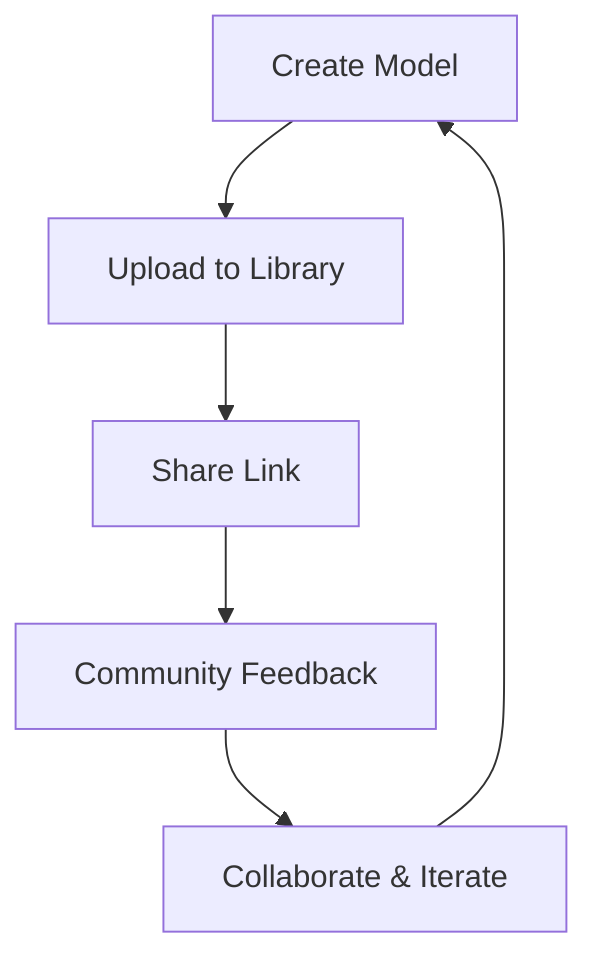

## Overview

Yellow DirkShark empowers you to discover, build, and share LEGO creations using your existing inventory. You can search vast libraries of designs, follow precise instructions, create custom models with real-time inventory checks, and collaborate with the community. These core tools streamline your LEGO experience from inspiration to completion.

<Columns cols={2}>
  <Card title="Search & Discover" icon="search" href="#searching">
    Find designs matching your pieces and themes.
  </Card>
  <Card title="Build & Create" icon="tool" href="#building">
    Follow instructions or invent new models.
  </Card>
  <Card title="Check Inventory" icon="package" href="#custom-creation">
    Verify piece availability instantly.
  </Card>
  <Card title="Share & Collaborate" icon="users" href="#sharing">
    Publish projects and join community builds.
  </Card>
</Columns>

## Searching and Filtering LEGO Designs

Locate perfect projects quickly with advanced search tools. Enter keywords, filter by theme, piece count, or difficulty, and sort results by popularity or recency.

<Tabs>
  <Tab title="Keyword Search" icon="search">
    Type terms like `Castle` or `Spaceship` to browse thousands of designs.
  </Tab>
  <Tab title="Advanced Filters" icon="sliders">
    Narrow by:
    
    | Filter       | Options                  |
    |--------------|--------------------------|
    | Theme        | Star Wars, City, Castle |
    | Pieces       | `<100`, `100-500`, `>500` |
    | Difficulty   | Beginner, Intermediate, Expert |
    | Year         | 2020-2024               |
  </Tab>
  <Tab title="Your Inventory" icon="package">
    Match designs to your collection automatically.
  </Tab>
</Tabs>

<Callout kind="tip">
  Save frequent searches as bookmarks for quick access later.
</Callout>

## Step-by-Step Building Instructions

Once you select a design, access interactive instructions. Zoom, rotate views, and track progress with checkboxes.

<Steps>
  <Step title="Download Instructions" icon="download">
    Get PDF or digital MOC files directly.
  </Step>
  <Step title="Follow Steps" icon="play">
    View 3D renders for each stage.
  </Step>
  <Step title="Mark Complete" icon="check-circle">
    Check off sub-steps and see completion percentage.
  </Step>
</Steps>

## Custom Model Creation with Inventory Checker

Build originals by combining parts. The inventory checker scans your collection to suggest viable designs.

<CodeGroup tabs="JavaScript,Python">
  ```javascript
  // Check if you have pieces for a model
  const checker = new InventoryChecker('your-collection-id');
  const canBuild = await checker.verifyModel('model-12345');
  console.log(canBuild.missingPieces); // Array of needed parts
  ```
  ```python
  # Verify model feasibility
  from yellow_dirkshark import InventoryChecker
  checker = InventoryChecker('your-collection-id')
  result = checker.verify_model('model-12345')
  print(result.missing_pieces)
  ```
</CodeGroup>

<Expandable title="Advanced Inventory Sync" default-open="false">
  Sync your physical collection via mobile scan or CSV upload. The checker updates in real-time as you acquire new sets.
</Expandable>

## Community Sharing and Collaboration Tools

Share your MOCs, get feedback, and co-build. Upload designs, add instructions, and invite collaborators.



<Callout kind="success">
  Featured projects gain visibility and earn community badges.
</Callout>

These features make Yellow DirkShark your go-to for LEGO innovation. Start by [searching designs](#searching) or [creating your first model](#custom-creation).