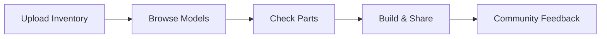

## Overview

Yellow DirkShark empowers you to discover, create, and share LEGO projects using pieces from your existing collections. Browse thousands of user-generated models, build custom designs with virtual inventory checks, and access free instructions for endless creativity. Whether you have a small brick stash or a massive collection, Yellow DirkShark turns your LEGO into new adventures.

## Key Features

Yellow DirkShark offers powerful tools tailored for LEGO fans. Use these core capabilities to maximize your building experience.

<Columns cols={3}>
  <Card title="Discover Models" icon="search" href="#discover">
    Explore a vast library of user-created MOCs (My Own Creations). Filter by theme, piece count, or difficulty.
  </Card>
  <Card title="Build with Inventory" icon="package" href="#build">
    Upload your collection and get real-time feedback on buildable models. No more guessing if you have the parts.
  </Card>
  <Card title="Share Your Creations" icon="share-2" href="#share">
    Upload designs, instructions, and photos. Connect with a global community of builders.
  </Card>
</Columns>

## Benefits for Your Collection

You save time and money by building only with what you own. Yellow DirkShark eliminates impulse buys—check compatibility before committing. Join millions of users who have rediscovered their bricks through smart inventory management and inspired designs.

<Callout kind="tip">
  Start small: Upload just 100 pieces to test compatibility and unlock personalized recommendations.
</Callout>

## Quick Start

Get building in minutes with these steps.

<Steps>
  <Step title="Create Account" icon="user-plus">
    Sign up at `https://dashboard.example.com/register` with your email. Verify instantly.
  </Step>
  <Step title="Upload Inventory" icon="upload">
    Use the scanner or CSV import to add your LEGO pieces.

````csv
Part ID,Quantity,Color
3001,10,Red
3024,5,Blue
```
````

  </Step>
  <Step title="Browse and Build" icon="zap">
    Search models and click "Check Build" to see what's possible with your collection.
  </Step>
  <Step title="Share First Project" icon="share">
    Build virtually, then upload your real creation to the community.
  </Step>
</Steps>

## Explore More

Dive deeper into Yellow DirkShark with these guides.

<Columns cols={2}>
  <Card title="Quickstart Guide" icon="book-open" href="/quickstart">
    Set up your full inventory and build your first model.
  </Card>
  <Card title="Community Projects" icon="users" href="/projects">
    Find inspiration from top-rated designs.
  </Card>
  <Card title="API Integration" icon="code" href="/authentication">
    Automate inventory syncs with your apps.
  </Card>
  <Card title="Help & Support" icon="help-circle" href="/help-center">
    FAQs, tutorials, and troubleshooting.
  </Card>
</Columns>

<Callout kind="info">
  Ready to build? Head to the [Quickstart](/quickstart) for hands-on setup. Your LEGO collection awaits!
</Callout>

