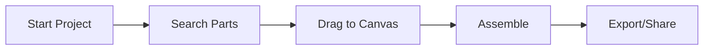

## Prerequisites

Before you begin, ensure you have:

- A valid email address for account verification
- A list or inventory of your existing LEGO sets and pieces (export from apps like Brickset or manual list)
- Access to a modern web browser (Chrome, Firefox, Safari)

<Callout kind="info">

Yellow DirkShark works best on desktop for initial setup, but you can use the mobile app for scanning collections later.

</Callout>

## Create and Verify Your Account

Sign up takes under 2 minutes. Follow these steps to get started.

<Steps>
  <Step title="Visit the Dashboard" icon="globe">
    Navigate to the [Yellow DirkShark app](https://app.yellowdirkshark.com/signup).
  </Step>

  <Step title="Fill Out the Form" icon="user-plus">
    Enter your email, create a strong password, and agree to the terms.

    Required fields:
    
    | Field     | Description                  |
    |-----------|------------------------------|
    | Email     | Your verification address    |
    | Password  | At least 8 characters strong |
    | Username  | Unique display name          |
  </Step>

  <Step title="Verify Your Email" icon="mail">
    Check your inbox (and spam folder) for a verification link from `no-reply@yellowdirkshark.com`. Click it to activate your account.

    <Callout kind="tip">
      Didn't receive the email? Use the "Resend Verification" button on the login page.
    </Callout>
  </Step>
</Steps>

## Upload Your LEGO Collection

Add your pieces to unlock personalized build recommendations. You can upload via web form, CSV, or app scanner.

<Steps>
  <Step title="Log In and Navigate" icon="log-in">
    Go to [https://app.yellowdirkshark.com/dashboard](https://app.yellowdirkshark.com/dashboard) > `Collections` > `Upload`.
  </Step>

  <Step title="Prepare Your Data" icon="file-text">
    For bulk upload, create a CSV file with your inventory. Use this format:

    ````csv
    set_number,quantity,color_id,name
    42055-1,1,11,Mars Rover
    21318-1,2,1,Tree House
    ````

    Generate sample data programmatically if needed:

    <CodeGroup tabs="JavaScript,Python">
      ````javascript
      const inventory = [
        { set_number: '42055-1', quantity: 1, color_id: 11, name: 'Mars Rover' },
        { set_number: '21318-1', quantity: 2, color_id: 1, name: 'Tree House' }
      ];

      const csvContent = 'set_number,quantity,color_id,name\n' +
        inventory.map(item => `${item.set_number},${item.quantity},${item.color_id},${item.name}`).join('\n');

      const blob = new Blob([csvContent], { type: 'text/csv' });
      const url = window.URL.createObjectURL(blob);
      const a = document.createElement('a');
      a.href = url;
      a.download = 'lego-inventory.csv';
      a.click();
      ````

      ````python
      import csv

      inventory = [
          {'set_number': '42055-1', 'quantity': 1, 'color_id': 11, 'name': 'Mars Rover'},
          {'set_number': '21318-1', 'quantity': 2, 'color_id': 1, 'name': 'Tree House'}
      ]

      with open('lego-inventory.csv', 'w', newline='') as file:
          writer = csv.DictWriter(file, fieldnames=['set_number', 'quantity', 'color_id', 'name'])
          writer.writeheader()
          writer.writerows(inventory)
      print("CSV generated: lego-inventory.csv")
      ````
    </CodeGroup>
  </Step>

  <Step title="Upload and Sync" icon="upload-cloud">
    Drag your CSV or use the piece scanner. Sync completes in seconds—your available parts now power build suggestions.
  </Step>
</Steps>

## Browse User-Generated Content

Discover thousands of designs from the community.

<Tabs>
  <Tab title="MOCs" icon="star">
    My Own Creations: Custom models like spaceships and castles. Filter by piece count or theme.
  </Tab>

  <Tab title="Instructions" icon="book-open">
    Step-by-step PDFs for official and fan builds. Download directly.
  </Tab>

  <Tab title="Parts Library" icon="package">
    Search 50,000+ pieces by color, shape, or set. Preview compatibility with your collection.
  </Tab>
</Tabs>

## Build Your First Custom Model

Create a simple car using your uploaded pieces.

<Steps>
  <Step title="Start a New Build" icon="plus">
    Dashboard > `New Project` > Select `Custom MOC`.
  </Step>

  <Step title="Search and Add Parts" icon="search">
    Type `wheel 2x2`—drag matching parts from results to the canvas. Yellow DirkShark highlights compatible items.
  </Step>

  <Step title="Assemble and Save" icon="save">
    Rotate, snap, and position. Export as PDF instructions or 3D file. Share publicly or privately.
  </Step>
</Steps>



## Next Steps

<Columns cols={3}>
  <Card title="Advanced Builds" icon="code" href="/guides/advanced-building">
    Explore tools like snap physics and 3D export.
  </Card>

  <Card title="Share Your Creations" icon="share-2" href="/sharing">
    Publish to the library and get feedback.
  </Card>

  <Card title="API Integration" icon="api" href="/developer/api">
    Automate with our REST API.
  </Card>
</Columns>

<Callout kind="success">
  Congratulations! You've built your first model. Check your dashboard for personalized recommendations.
</Callout>